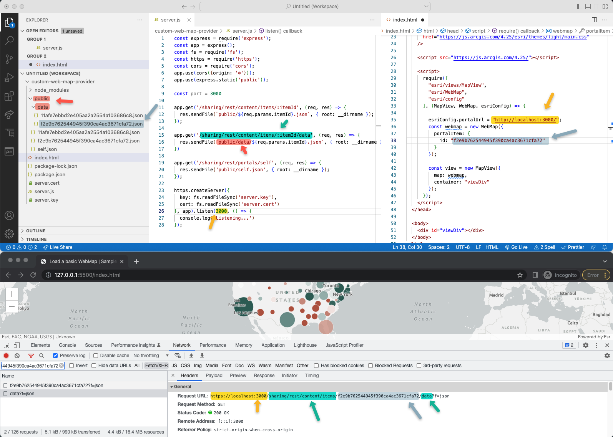

# Custom web map provider

This is a simple demo project that shows how to fake the "<a href="https://developers.arcgis.com/documentation/mapping-apis-and-services/content-management/items/#get-an-item">get item</a>" and "<a href="https://developers.arcgis.com/documentation/mapping-apis-and-services/content-management/items/#get-item-data">get item data</a>" endpoints from the ArcGIS Portal API to 
allow you to serve your the <a href="https://developers.arcgis.com/web-map-specification/"> ArcGIS web map JSON object spec</a> from your own Node server.



## Install

### Prerequisites

#### Set credentials
Create an `auth-credentials.js` file with the following info:

```js
export const myAPIKey = '<YOUR API KEY';
export const client_id = '<YOUR CLIENT ID>';
export const client_secret = '<YOUR CLIENT SECRET>';

export default { myAPIKey, client_id, client_secret } 
```

> **Note**: If you don't know how, check the [Tutorial: Create an API key](https://developers.arcgis.com/documentation/security-and-authentication/api-key-authentication/tutorials/create-an-api-key/) and [Tutorial: Create OAuth credentials for app authentication](https://developers.arcgis.com/documentation/security-and-authentication/app-authentication/tutorials/create-oauth-credentials-app-auth/)

#### SSL certificates

Create your own open ssl certificate: `openssl req -nodes -new -x509 -keyout src/server.key -out src/server.cert`

## Run development environment

1. Run: `npm install`.
3. Run: `npm run dev`

> **Important**: you will have to open the Developer tools, check the `ERR_CERT_AUTHORITY_INVALID` error, open the request and mark it as secured. Then refresh

## Backup the web map and load the local copy

> **Note**: If is configured to work witn ArcGIS Online and ArcGIS Location Platform. 
If you need help to make it work with ArcGIS Enterprise, ask in the issues.

1. Open [download-web-map.js](./src/download-web-map.js) and edit the `webmapId` you want to download.
2. Run `node download-web-map.js`
3. Edit [index.html](./src/index.html) and replace `portalItem: { id: "afbb770f9d65402d9f1b053afabc4413" }` with the same id.

## Questions/contributions

Please feel free to use the issues.